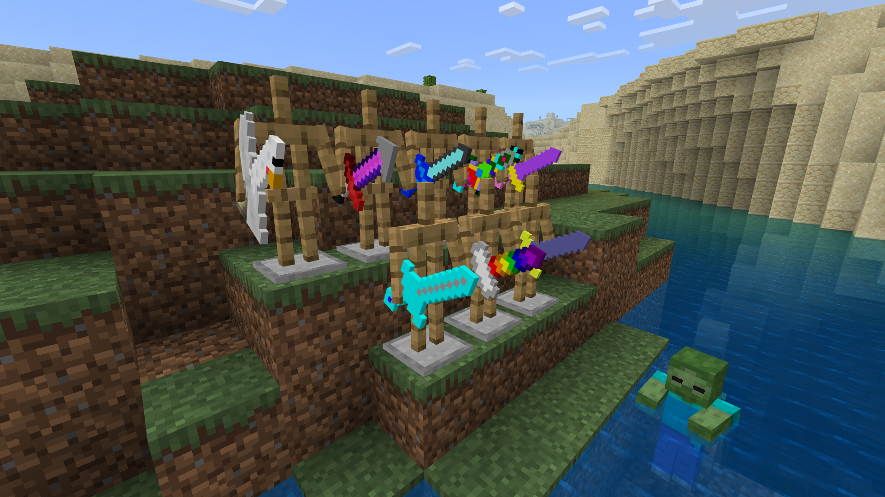
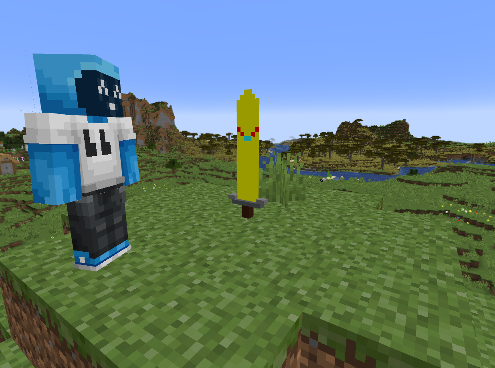

## New Swords

- Arrow Sword: Shoots arrows
- Bee Blade: Summons bees
- Chicken Sword: Shoots eggs, sometimes summons chickens
- Master Sword
- One Sword: Super powerful but breaks after one hit
- Pow Sword: Turns the block you are standing on into water
- Power Sword: Creates a slime block
- Powy: Turns the block you are standing on into lava
- Rainbow Sword: Creates a wool rainbow
- Thunder Blade: Lightning strikes whatever mob you hit
- Ultra Sword: Creates a block of ice
- Crazata Sword: Official sword of Crazata
- Golden Katana
- Sapphire Sword: Be careful for poison
- Golden Ender Dragon Sword
- Bread Sword
- Steel Sword
- Warden Sword
- Bouncy Sword - Bounces mobs straight up
- Baseball Bat - Launches mods far away
- Medicinal Sword - Heal your friends by hitting them on the head
